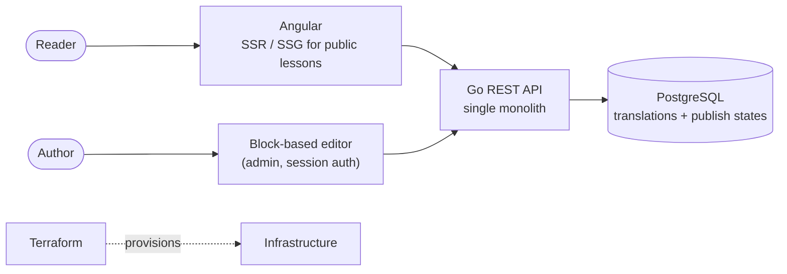

<h1 align="center">Hristijan Mijalkov</h1>

<b>Full-Stack &amp; AI Engineer</b> · Skopje, North Macedonia (UTC+2)

  
  
  

I build production web apps and the backend services behind them, end to end: the API, the database, the frontend and the cloud it runs on. Four-plus years shipping web systems across banking, SaaS, ERP integration, CMS and AI, including a banking platform used by multiple client banks, and on-prem AI that keeps business data inside the company network.

## Tech

  

## What I'm building: DAWN

[**DAWN**](https://www.dawnlearn.com) is a bilingual (English / Macedonian) teaching platform for programming and economics, "Code and economics, from scratch." I designed, built and deployed it solo, and have taught lessons to 30+ students on it.

The public pages are server-rendered so they load fast and get indexed. The editor is a custom block-based CMS (headings, code, images, callouts) with a draft/publish flow and an EN/MK switch. The repo is private; the site is live.

## Selected projects

| Project | What it is | Stack |
|---|---|---|
| [**kyc-service**](https://github.com/HowlinMan24/kyc-service) | Production-style KYC verification microservice: risk scoring, reviewer workflow, audit trail, OpenAPI docs | TypeScript · Express · Sequelize · JWT · Zod |
| [**terraform-cicd-pipeline**](https://github.com/HowlinMan24/terraform-cicd-pipeline) | GitHub Actions for Terraform: PR plans, security scan, approval gate before prod, OIDC instead of long-lived keys | Terraform · GitHub Actions · AWS |
| [**Student-Grading-App-with-LLMs**](https://github.com/HowlinMan24/Student-Grading-App-with-LLMs) | AI grading assistant with multi-model fallback and image upload | Angular · Spring Boot · MySQL · Kubernetes |
| [**serverless-observability-stack**](https://github.com/HowlinMan24/serverless-observability-stack) | Serverless API with a CloudWatch dashboard, metric-math alarms and SNS alerting | Terraform · Lambda · DynamoDB |
| [**rag-anything-eval**](https://github.com/HowlinMan24/rag-anything-eval) | On-prem evaluation of a knowledge-graph RAG library, plus a from-scratch cross-encoder reranker | Python · ChromaDB · Ollama |
| [**aws-vpc-foundation**](https://github.com/HowlinMan24/aws-vpc-foundation) | Reusable, secure-by-default multi-AZ VPC module; private subnets with no internet route | Terraform · AWS |

More: [system-design](https://github.com/HowlinMan24/system-design) (architecture patterns with diagrams) · [multiformat-rag-pipeline](https://github.com/HowlinMan24/multiformat-rag-pipeline) · [portfolio](https://github.com/HowlinMan24/portfolio)

## What I work on

- **Backend and APIs:** Node.js / TypeScript, Go, Python (FastAPI); PostgreSQL and MySQL
- **Full-stack:** Angular (incl. SSR), React and Next.js
- **Cloud and DevOps:** AWS, Terraform, Docker, Kubernetes, CI/CD
- **AI and data:** RAG, tool-calling agents, local LLMs, Microsoft Copilot Studio; ETL with PySpark and Kafka

Open to remote and contract work.
